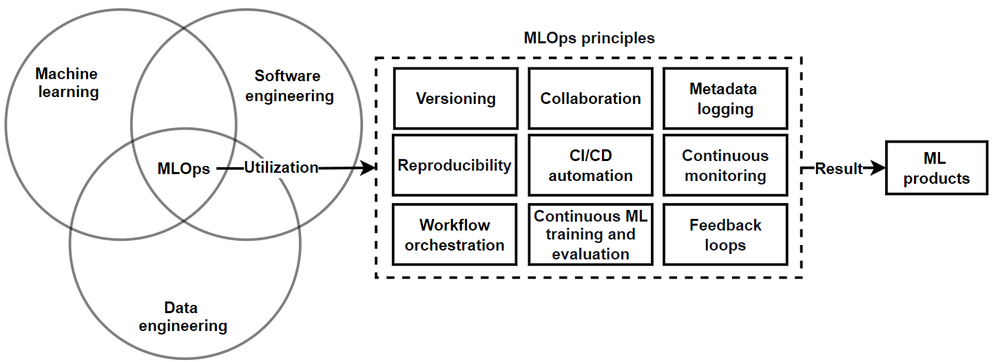
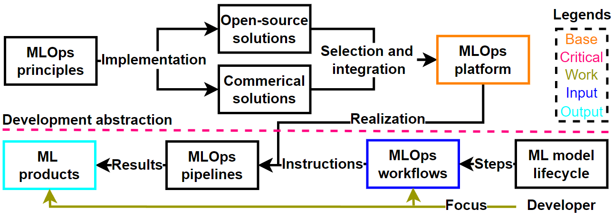
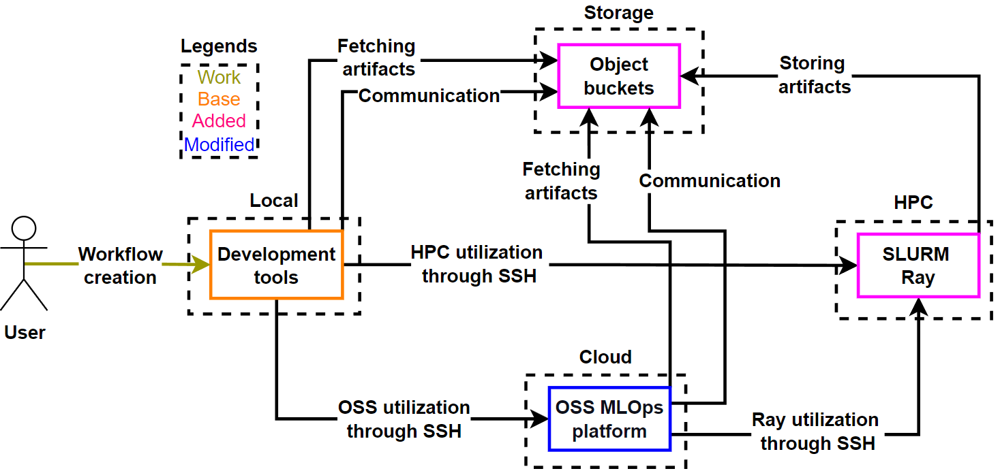

# How to Setup Integrated OSS MLOps Platform

We will go thorugh the necessery configuration on how to make the OSS MLOps platofrm run in CSC CPouta and utilize Ray clusters run in CSC supercomputers. We assume that you start from scratch. 

## What are MLOps Platforms

Machine learning operations (MLOps) is a intersection paradigm that [uses principles](https://arxiv.org/abs/2205.02302) to create machine learning products:



MLOps platforms provide a unified user interface for developing ML workflows and products:



Thus, MLOps platforms such as OSS provide a MLOps system that enable developers to focus on improving their products such as models. 

## Getting Started

To set up the integrated platform to cloud, you first need to have a CSC account and projects with access to the following services:

- [CPouta](https://docs.csc.fi/cloud/pouta/): Infrastructure as a service cloud platfrom
- [Allas](https://docs.csc.fi/data/Allas/): S3-based object storage platform
- [Puhti](https://docs.csc.fi/computing/systems-puhti/): SLURM-based HPC platform offering:
  - Petaflops: 1.8 CPU and 2.7 GPU
  - Nodes: 682 CPU and 80 GPU
  - Max nodes: 26 CPU and 20 GPU
  - Max time: 14 days for CPU and 3 days for GPU 
- [Mahti](https://docs.csc.fi/computing/systems-mahti/): SLURM-based HPC platform offering:
  - Petaflops: 7.5 CPU and 2.0 GPU
  - Nodes: 1404 CPU and 24 GPU
  - Max nodes: 700 CPU and 6 GPU
  - Max time: 7 days for CPU and 36 hours for GPU 
- [LUMI](https://docs.lumi-supercomputer.eu/hardware/): SLURM-based HPC platform offering:
  - Petaflops: 10.3 CPU and 379.70 GPU
  - Nodes: 2048 CPU and 2978 GPU
  - Max nodes: 512 CPU and 1024 GPU
  - Max time: 2 days for CPU and 2 days for GPU 

Please check the following official documentation:

- [Creation of CSC user account](https://docs.csc.fi/accounts/how-to-create-new-user-account/)
- [Getting service access](https://docs.csc.fi/accounts/how-to-add-service-access-for-project/) 
- [Cloud computing concepts](https://docs.csc.fi/cloud/)
- [Pouta security guidelines](https://docs.csc.fi/cloud/pouta/security/)
- [Pouta accounting](https://docs.csc.fi/cloud/pouta/accounting/)

## High-Level Integration Overview

The following diagram illustrates the architectural design of the cloud-HPC integrated MLOps platform:



### Key Components

- **SSH**: Secure connective bridge between enviroments.
- **Submitter**: Enables interactions between local and HPC enviroments.
- **Forwarder**: Provides a proxy for creating requests and Prometheus gauges for metrics in OSS.
- **Docker Compose**: Enables light deployment of Submitter.
- **Allas**: Global storage for communication and artifacts.
- **SLURM Ray**: Computing framework for Python that abstract away HPC details.

## Modifications

Here are the done modifications: 

1. In kubeflow/in-cluster-setup/kubeflow/kustomization.yaml the following components are removed
   - Katib, 
   - Jupyter web app
   - Notebook controller
   - PVC viewer
   - Volumes web app
   - Tensorboards controller
   - Tensorboard web app
   - Training operator
2. MinIO image in minio-deployment.yaml was changed to newest
3. A new MLflow image was created and set in mlflow-deployment.yaml
4. PostgreSQL image in postgresql-deployment.yaml was changed to newest
5. In monitoring/kustomization.yaml the following components are removed
   - Alert manager 
   - Pushgateway
6. Prometheus image in prometheus-deployment.yaml was changed to newest
7. Grafana image in grafana-deployment.yaml was changed to newest
8. Forwarder deployment was added
9. The deployment envs were modified to have the forwarder deployment

## Background

If you want to understand the technical details, check these links:

Mahti:
- [What is Mahti]( https://docs.csc.fi/support/tutorials/mahti_quick/)
- [Mahti partitions](https://docs.csc.fi/computing/running/batch-job-partitions/)
- [Connection to Mahti](https://docs.csc.fi/computing/connecting/)
- [Creating batch scripts for Mahti](https://docs.csc.fi/computing/running/creating-job-scripts-mahti/)
- [Example batch job scripts for Mahti](https://docs.csc.fi/computing/running/example-job-scripts-mahti/)
- [Python on CSC supercomputers](https://docs.csc.fi/apps/python/#installing-python-packages-to-existing-modules)

SSH:
- [Adding a new SSH key into cloud servers](https://www.servers.com/support/knowledge/linux-administration/how-to-add-new-ssh-key-to-a-cloud-server)
- [SSH connection "not possible"](https://askubuntu.com/questions/1399009/ssh-connection-not-possible-host-key-verification-failed)
- [SSH private key is too open](https://stackoverflow.com/questions/9270734/ssh-permissions-are-too-open)
- [How to create SSH tunnels](https://www.ssh.com/academy/ssh/tunneling-example)
- [Remote binding to localhost](https://serverfault.com/questions/997124/ssh-r-binds-to-127-0-0-1-only-on-remote)

Ray:
- [Running ray on SLURM](https://docs.ray.io/en/latest/cluster/vms/user-guides/community/slurm.html)

Headless services:
- [External services in kubernetes](https://stackoverflow.com/questions/57764237/kubernetes-ingress-to-external-service?noredirect=1&lq=1)
- [Headless services in kubernetes](https://kubernetes.io/docs/concepts/services-networking/service/#headless-services)

## Cloud VM Setup

### Creation

When you have managed to get a CSC user with a project with a access to [CPouta](https://pouta.csc.fi), you are now able to create virtual machines. Please check the following offical documentation:

- [Create CPouta VM](https://docs.csc.fi/cloud/pouta/launch-vm-from-web-gui/)
- [CPouta Flavors](https://docs.csc.fi/cloud/pouta/vm-flavors-and-billing/#standard-flavors)

Create a VM with the following details:

- Instance name: OSS-Platform (Can be changed)
- Flavor: Standard.xxlarge
- Instance Count: 1
- Instance Boot Source: Boot from image
- Image Name: Ubuntu-22.04

### Connection

Please check the following offical documentation:

- [CPouta connection](https://docs.csc.fi/cloud/pouta/connecting-to-vm/)

Create a local SSH config with the following:

```
Host cpouta
Hostname ()
User ()
IdentityFile ~/.ssh/local-cpouta.pem
```

Use the following command to connect to the VM:

```
ssh cpouta
```

### Update

To update the VM, run the following commands

```
sudo apt update
sudo apt upgrade # press enter, when you get a list
```

### Docker

To install and configure Docker into the VM, use the following official documentation:

- [Docker engine setup](https://docs.docker.com/engine/install/ubuntu/)
- [Remove sudo docker](https://docs.docker.com/engine/install/linux-postinstall/)

### Storage

You can [optionally](documentation/docker-storage.md) add more disk memory for the Docker VM.

### Networking

The VM security groups and SSH need to be configured in order to use HPC Ray in CPouta. Create SSH rules for [HPC](https://docs.csc.fi/cloud/dbaas/firewalls/) addresses. In the VM SSH config you need to set GatewayPorts to clientspecified by doing the following:

```
cat /etc/ssh/sshd_config
sudo nano /etc/ssh/sshd_config 
CTRL + X 
Enter 
sudo service ssh restart 
```

Finally, in order to enable Mahti SSH to connect, confirm that VM ssh authorized_keys contains respective Mahti SSH public key:

```
cd .ssh
ls
cat authorized_keys
```

If the public key of the Mahti key isn't there, copy it and add it with:

```
nano authorized_keys
CTRL + SHIFT + V
CTRL + X
Enter
```

If you are having proplems with SSH, you can debug SSH connections with:

```
ss -tuln
grep sshd /var/log/auth.log
ps aux | grep ssh
```

### GPUs

If your VM has access to GPUs, they can be [setup](documentation/gpu-setup.md) for Docker and KinD. 

### OSS

To run the OSS MLOps platform in the VM, do the following:

```
git clone https://github.com/OSS-MLOPS-PLATFORM/oss-mlops-platform.git
cd oss-mlops-platform (You might need to switch branches)
./setup.sh (Select relevant options)
```

When the setup is complete, use the following to confirm that all pods are running:

```
kubectl get pods -A
```

### Images

CPouta enables creating custom VM images, which enable skipping most of the previous setup. For details check the offical documentation:

- [Creating and sharing images](https://docs.csc.fi/cloud/pouta/adding-images/)

## Local Compose Setup

### Code

Download the repository with:

```
git clone https://github.com/OSS-MLOPS-PLATFORM/oss-mlops-platform.git
cd oss-mlops-platform (You might need to switch branches)
```

### Credentials

To use integration, you need to create a .env in your PC .ssh folder with the following:

```
CSC_USERNAME = "(your_csc_username)"  
CSC_PASSWORD = "(your_csc_password)"
CSC_USER_DOMAIN_NAME = "Default"
CSC_PROJECT_NAME = "project_(your_csc_project_number)"
```

### SSH

We need to setup SSH credentials for the submitter. Please read through the following offical documentation:

- [CPouta SSH keys](https://docs.csc.fi/cloud/pouta/launch-vm-from-web-gui/#setting-up-ssh-keys)
- [Mahti SSH key](https://docs.csc.fi/computing/connecting/ssh-keys/)

Now, if you for example want to add Mahti support, do the following actions:

1. Go to PC .ssh folder and create compose-secrets.json containing the following with brackets filled:
   
```
{
    "CLOUD_ENVIROMENT": "none", # Leave as is
    "CLOUD_ADDRESS": "none",  # Leave as is
    "CLOUD_USER": "none",  # Leave as is
    "CLOUD_KEY": "none",  # Leave as is
    "CLOUD_PASSWORD": "empty",  # Leave as is
    "STORAGE_ENVIROMENT": "allas",
    "STORAGE_USER": "token", # Allas is always token based
    "STORAGE_PASSWORD": "token", # Allas is always token based
    "HPC_ENVIROMENT": "mahti",
    "HPC_ADDRESS": "mahti.csc.fi",
    "HPC_USER": "(your_csc_user)", 
    "HPC_KEY": "/run/secrets/local-mahti",
    "HPC_PASSWORD": "(your_ssh_password)", 
    "INTEGRATION_ENVIROMENT": "cpouta-mahti",
    "INTEGRATION_KEY": "/run/secrets/cpouta-mahti",
    "INTEGRATION_PASSWORD": "empty" # password or empty
}
```

2. Use CPouta to create cpouta-mahti.pem file and save it into PC .ssh folder. Its recommeded that the key doesn't get passphrase.

3. Use your PC to create local-mahti.pem file and save it to PC .ssh folder.

4. Add the following to .ssh/config:

```
Host mahti
Hostname mahti.csc.fi
User ()
IdentityFile ~/.ssh/local-mahti.pem
```

5. Activate the Mahti key using MyCSC

6. Test that SSH works:

```
ssh mahti
exit/logout # CTRL + C if hangs
```

7. Get the absolute paths of the compose-secrets.json and keys with

```
pwd
```

8. Go to submitter deployment folder and use the PWD paths to fill the secrets paths of stack.yaml with

```
cd cloud-hpc-oss-mlops-platform/applications/article/submitter/deployment/production
nano stack.yaml
CTRL + X (Select Y to save)
```

## Tools

### Local

To access the submitter use the following:

```
cd cloud-hpc-oss-mlops-platform/applications/article/submitter/deployment/production
docker compose -f stack.yaml up # Start
```

The submitter frontend and monitoring are available at

```
http://localhost:6600/docs
http://localhost:6601 (username is flower123 and password is flower456)
```

You can shutdown Submitter with:

```
CTRL + C # Shutdown
docker compose -f stack.yaml down # Shutdown
```

### Cloud

To access OSS tools use the following:

```
# Kubeflow central dashboard
ssh -L 8080:localhost:8080 cpouta
kubectl port-forward svc/istio-ingressgateway 8080:80 -n istio-system
http://localhost:8080 (address is user@example.com and password 12341234)

# Kubeflow MinIO
ssh -L 9000:localhost:9000 cpouta
kubectl port-forward svc/minio-service 9000:9000 -n kubeflow
http://localhost:9000 (user is minio and password minio123)

# MLflow
ssh -L 5000:localhost:5000 cpouta
kubectl port-forward svc/mlflow 5000:5000 -n mlflow 
http://localhost:5000

# MLflow MinIO
ssh -L 9001:localhost:9001 cpouta
kubectl port-forward svc/mlflow-minio-service 9001:9001 -n mlflow
http://localhost:9001 (user and password is minioadmin)

# Prometheus
ssh -L 8090:localhost:8090 cpouta
kubectl port-forward svc/prometheus-service 8090:8080 -n monitoring
http://localhost:8090

# Grafana
ssh -L 5050:localhost:5050 cpouta
kubectl port-forward svc/grafana 5050:3000 -n monitoring
http://localhost:5050 (user and password is admin)

# Forwarder frontend
ssh -L 6500:localhost:6500 cpouta
kubectl port-forward svc/fastapi-service 6500:6500 -n forwarder
http://localhost:6500/docs

# Forwarder Monitor
ssh -L 6501:localhost:6501 cpouta
kubectl port-forward svc/flower-service 6501:6501 -n forwarder
http://localhost:6501 (username is flower123 and password is flower456)

# Ray Dashboard (during SLURM runs)
ssh -L 127.0.0.1:8280:(VM_private_ip):8280 cpouta
http://localhost:8280
```

All of these can be closed with:

```
CTRL + C
exit/logout # CTRL + C if hangs
```

## Troubleshooting

**Error: response from daemon: driver failed programming external connectivity on endpoint kind-ep-control-plane**

This error is related to a existing docker [issue](https://github.com/moby/moby/issues/25981), where docker-proxy binds to ports when no containers run or exist. There isn't permanent solution, but the temporary solution is the following:

```
netstat -tuln # Check active ports
sudo systemctl stop docker
sudo rm -rf /var/lib/docker/network/files
sudo systemctl start docker
netstat -tuln # Check that the port is gone
```

Sometimes this doesn't work, but fortunelly in those cases we can do the following:

```
sudo lsof -i :port
sudo kill (shown PID)
```

**Error: could not kill running container when trying to delete kind registry**

Sometimes when you try to remove kind registry, you receive permission denied error. There isn't a permanent solution, but we can temporarily fix it with the following command:

```
docker ps 
sudo ps awx | grep containerd-shim | grep <<container_id>> | awk '{print $1}'
sudo kill -9 <<process_id>>
```

**Error: kubectl get pods -A doesn't reach APIs**

This happens, when a mounted CPouta has been unmounted due to shelving the VM, which results in the docker not being able to use the containers stored in the volume and kubectl unable to connect to the kind container, giving the following error:

```
E1010 12:29:13.059050    1322 memcache.go:265] couldn't get current server API group list: Get "https://127.0.0.1:35825/api?timeout=32s": dial tcp 127.0.0.1:35825: connect: connection refused
The connection to the server 127.0.0.1:35825 was refused - did you specify the right host or port?
```

This is also seen in docker info in:

```
Server:
 Containers: 0
  Running: 0
  Paused: 0
  Stopped: 0
```

This is also seen in df -h in:

```
Filesystem      Size  Used Avail Use% Mounted on
tmpfs            12G  1.1M   12G   1% /run
/dev/vda1        78G   18G   60G  23% /
tmpfs            58G     0   58G   0% /dev/shm
tmpfs           5.0M     0  5.0M   0% /run/lock
/dev/vda15      105M  6.1M   99M   6% /boot/efi
tmpfs            12G  8.0K   12G   1% /run/user/1000
```

The solution is to mount the volume back. Do the following:

```
sudo parted -l
```

This should give the following example:

```
Model: Virtio Block Device (virtblk)
Disk /dev/vdb: 537GB
Sector size (logical/physical): 512B/512B
Partition Table: loop
Disk Flags: 

Number  Start  End    Size   File system  Flags
 1      0.00B  537GB  537GB  xfs
```

Assuming that your volume has the same name and you have followed the previous instructions, we can fix this with:

```
sudo mount /dev/vdb /media/volume
sudo systemctl stop docker
sudo systemctl stop docker.socket
sudo systemctl stop containerd
sudo systemctl start docker
docker info
```

The file system should show the following:

```
Filesystem      Size  Used Avail Use% Mounted on
tmpfs            12G  1.1M   12G   1% /run
/dev/vda1        78G   18G   60G  23% /
tmpfs            58G     0   58G   0% /dev/shm
tmpfs           5.0M     0  5.0M   0% /run/lock
/dev/vda15      105M  6.1M   99M   6% /boot/efi
tmpfs            12G  8.0K   12G   1% /run/user/1000
/dev/vdb        500G   26G  475G   6% /media/volume
```

Docker should now show the following:

```
Server:
 Containers: 2
  Running: 2
  Paused: 0
  Stopped: 0
```

It will take a moment for the containers to spin up again, but after that you should be able to use

```
kubectl get pods -A
```

to get:

```
NAMESPACE                   NAME                                                              READY   STATUS      RESTARTS      AGE
auth                        dex-b554fc4dc-kdpk7                                               1/1     Running     0             45d
cert-manager                cert-manager-796fb4dd87-dz592                                     1/1     Running     0             45d
cert-manager                cert-manager-cainjector-59c444b899-96wlz                          1/1     Running     0             45d
cert-manager                cert-manager-webhook-79b8b97bc-fhfjm                              1/1     Running     0             45d
default                     kuberay-operator-9986f78b7-9xbkm                                  1/1     Running     0             45d
default                     raycluster-kuberay-head-5lxph                                     1/1     Running     0             45d
default                     raycluster-kuberay-worker-workergroup-5cqmg                       1/1     Running     0             45d
forwarder                   celery-server-7d45765b5d-bjpkg                                    1/1     Running     0             45d
forwarder                   fastapi-server-67fdcc875-bvdkt                                    1/1     Running     0             45d
forwarder                   flower-server-5cdfcc848-gdxcg                                     1/1     Running     0             45d
forwarder                   redis-server-55f9f96ddd-nvwvs                                     1/1     Running     0             45d
gpu-operator                gpu-feature-discovery-bdhnq                                       1/1     Running     0             45d
gpu-operator                gpu-operator-1724667890-node-feature-discovery-gc-fbdf8b7df94bq   1/1     Running     0             45d
gpu-operator                gpu-operator-1724667890-node-feature-discovery-master-5d5fcc22s   1/1     Running     0             45d
gpu-operator                gpu-operator-1724667890-node-feature-discovery-worker-h74pj       1/1     Running     0             45d
gpu-operator                gpu-operator-589ccf7db6-hqf2p                                     1/1     Running     0             45d
gpu-operator                nvidia-container-toolkit-daemonset-fbdpc                          1/1     Running     0             45d
gpu-operator                nvidia-cuda-validator-8n6jt                                       0/1     Completed   0             45d
gpu-operator                nvidia-dcgm-exporter-9rxnc                                        1/1     Running     0             45d
gpu-operator                nvidia-device-plugin-daemonset-49684                              1/1     Running     0             45d
gpu-operator                nvidia-operator-validator-c8glv                                   1/1     Running     0             45d
istio-system                cluster-local-gateway-687c8948c6-qmfb8                            1/1     Running     0             45d
istio-system                istio-ingressgateway-66d47846bf-dbnst                             1/1     Running     0             45d
istio-system                istiod-648484cc47-6q642                                           1/1     Running     0             45d
istio-system                oidc-authservice-0                                                1/1     Running     0             45d
knative-eventing            eventing-controller-578d54cd44-pr2mp                              1/1     Running     0             45d
knative-eventing            eventing-webhook-b56b949d4-zpt5b                                  1/1     Running     0             45d
knative-serving             activator-59f69b9576-clfk8                                        2/2     Running     0             45d
knative-serving             autoscaler-79f56fb496-rkjzx                                       2/2     Running     0             45d
knative-serving             controller-5889d4cbcd-qjmlm                                       2/2     Running     0             45d
knative-serving             domain-mapping-748d586947-zljkk                                   2/2     Running     0             45d
knative-serving             domainmapping-webhook-545f959ccf-zqgnj                            2/2     Running     0             45d
knative-serving             net-istio-controller-8685dc8d99-ftgtb                             2/2     Running     0             45d
knative-serving             net-istio-webhook-5d5ffc574f-qw7wk                                2/2     Running     0             45d
knative-serving             webhook-587b9fb654-mxq9l                                          2/2     Running     0             45d
kube-system                 coredns-6d4b75cb6d-c5w9j                                          1/1     Running     0             45d
kube-system                 coredns-6d4b75cb6d-xk5d5                                          1/1     Running     0             45d
kube-system                 etcd-mlops-platform-control-plane                                 1/1     Running     0             45d
kube-system                 kindnet-twmv6                                                     1/1     Running     0             45d
kube-system                 kube-apiserver-mlops-platform-control-plane                       1/1     Running     0             45d
kube-system                 kube-controller-manager-mlops-platform-control-plane              1/1     Running     1 (46s ago)   45d
kube-system                 kube-proxy-vxk9l                                                  1/1     Running     0             45d
kube-system                 kube-scheduler-mlops-platform-control-plane                       1/1     Running     0             45d
kubeflow-user-example-com   ml-pipeline-ui-artifact-5b4465bcb7-btjqk                          2/2     Running     0             45d
kubeflow-user-example-com   ml-pipeline-visualizationserver-5568776585-xmsb9                  2/2     Running     0             45d
kubeflow                    admission-webhook-deployment-57b6857cc5-phgms                     1/1     Running     0             45d
kubeflow                    cache-server-86584db5d8-lp6g7                                     2/2     Running     0             45d
kubeflow                    centraldashboard-77466bcf94-t7pk7                                 2/2     Running     0             45d
kubeflow                    kserve-controller-manager-6488c5ffb8-bcwps                        2/2     Running     0             45d
kubeflow                    kserve-models-web-app-f9c576856-xjnqg                             2/2     Running     0             45d
kubeflow                    kubeflow-pipelines-profile-controller-5dd5468d9b-wjgs4            1/1     Running     0             45d
kubeflow                    metacontroller-0                                                  1/1     Running     0             45d
kubeflow                    metadata-envoy-deployment-76c587bd47-t4qwh                        1/1     Running     0             45d
kubeflow                    metadata-grpc-deployment-5c8599b99c-5wtjm                         2/2     Running     6 (45d ago)   45d
kubeflow                    metadata-writer-6c576c94b8-xkvlt                                  2/2     Running     3 (45d ago)   45d
kubeflow                    minio-6d6d45469f-tqqch                                            2/2     Running     0             45d
kubeflow                    ml-pipeline-77d4d9974b-bm7ng                                      2/2     Running     2 (45d ago)   45d
kubeflow                    ml-pipeline-persistenceagent-75bccd8b64-tgptk                     2/2     Running     0             45d
kubeflow                    ml-pipeline-scheduledworkflow-6dfcd5dd89-9z55g                    2/2     Running     0             45d
kubeflow                    ml-pipeline-ui-5ddb5b76d8-cxdqd                                   2/2     Running     0             45d
kubeflow                    ml-pipeline-viewer-crd-86cbc45d9b-7swcm                           2/2     Running     1 (45d ago)   45d
kubeflow                    ml-pipeline-visualizationserver-5577c64b45-cm4pg                  2/2     Running     0             45d
kubeflow                    mysql-6878bbff69-gk9bg                                            2/2     Running     0             45d
kubeflow                    profiles-deployment-86bcdbb57f-2v44l                              3/3     Running     2 (45d ago)   45d
kubeflow                    workflow-controller-78c979dc75-2wqtj                              2/2     Running     2 (45d ago)   45d
local-path-storage          local-path-provisioner-9cd9bd544-hghjb                            1/1     Running     0             45d
mlflow                      mlflow-5957f7d8d5-xwxsw                                           1/1     Running     0             45d
mlflow                      mlflow-minio-6fc44b6f8b-f2jln                                     1/1     Running     0             45d
mlflow                      postgres-869457dfd8-zc868                                         1/1     Running     0             45d
monitoring                  grafana-59489dc89-d6mxh                                           1/1     Running     0             45d
monitoring                  prometheus-deployment-6c54c9d685-rlhhh                            1/1     Running     0             45d
```

**Error: failed to initilize NVML: Driver/library version mismatch**

This happens, when update makes the libraries go out of sync. A common fix is to simply reboot with

```
sudo reboot
```

## Articles

Indepth details for integration models and development are found in the following articles:

[Siilasjoki, N, Raatikainen, M & Nurminen, JK 2025, A Design Framework for Cloud-HPC Integration in MLOps. ACM/SIGAPP Symposium On Applied Computing (ACM SAC): Track on Cloud Continuum.](https://doi.org/10.1145/3672608.3707866)