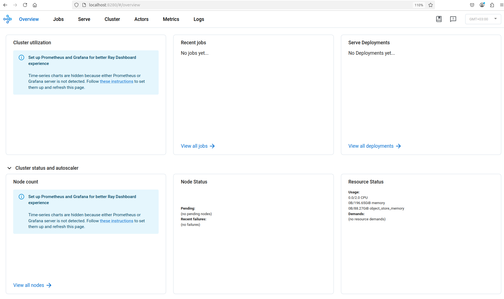
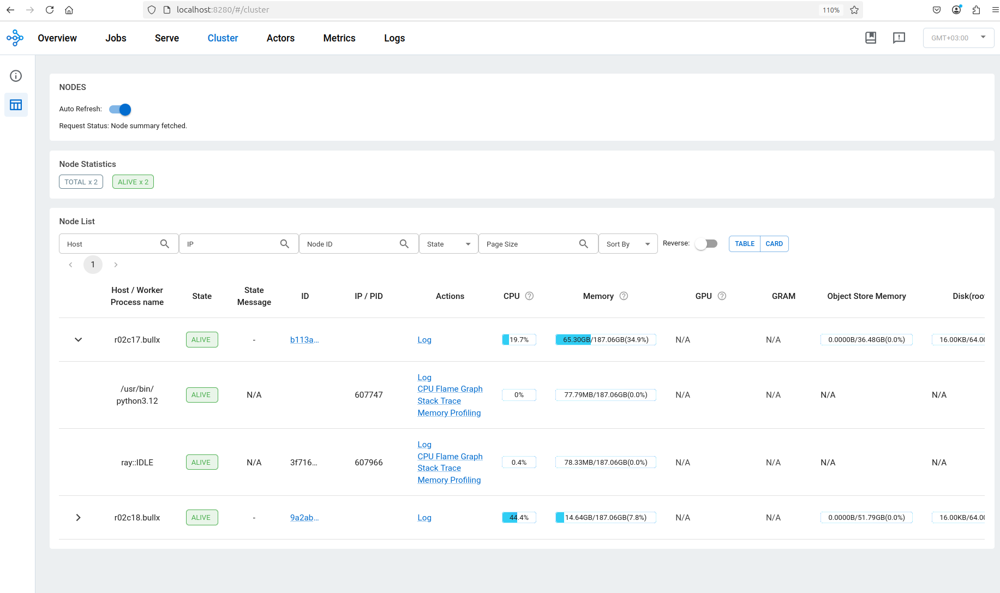
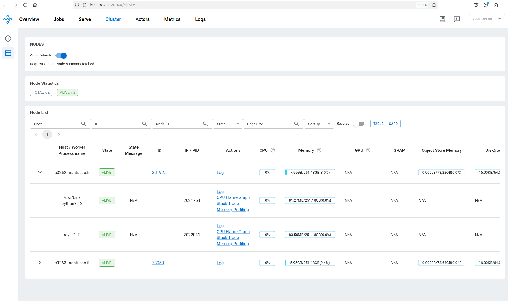
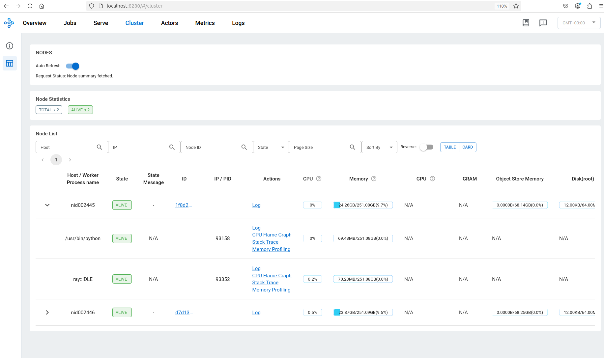

# How to prove the cloud-HPC integrability of high-performance computing enviroments

We will go through the necessary actions and requirements for proving that a given high-performance computing (HPC) enviroment can be integrated with cloud platforms for distributed computing. The example ecosystem we will use in integration is the [center for scientific computing](https://csc.fi/en/) (CSC).

## Access

You need to have access to a cloud platform and a HPC platform. The cloud platform needs to have a running virtual machine (VM) and the HPC platform should use SLURM scheduler with the ability to run Python programs. Access to cloud platforms only requires money, while HPC platforms usually have curated access. 

Supercomputers maintained especially by institutions require valid reasons, research funding and technical setup for utilization. Usually these institutions have good documentation, such as CSC's service catalog for reference: [CPouta](https://research.csc.fi/service/cpouta-community-cloud-service/), [EPouta](https://research.csc.fi/service/epouta/), [Allas](https://research.csc.fi/service/allas-data-storage-service-for-research-projects/), [Pukki](https://research.csc.fi/service/pukki-database-as-a-service-dbaas/), [Puhti](https://research.csc.fi/service/puhti/), [Mahti](https://research.csc.fi/service/mahti/) and [LUMI](https://research.csc.fi/service/lumi-supercomputer/). 

It is highly likely that getting access to powerful HPC platforms will be the biggest hurdle. For academics it might be as quick as pushing few buttons in the vendor UI, while for commerical companies there might be need to send a few emails to the vendor. Different vendors have their own procedures for providing access.   

Establishing collaboration with the vendor and other parties intrested increases the success, but not necessarily the aquisition speed. Be prepared to wait atleast weeks to months for the byrocracy to be handeled if you want to use the most powerful HPC platforms.  

## Setup

The first action is to create a VM with a Linux operating system. Our recommendation is Ubuntu 22.04. [When the VM is running and you have connected to it](https://docs.csc.fi/cloud/pouta/launch-vm-from-web-gui/), you need to confirm that it has a running [SSH](https://www.ssh.com/academy/ssh). You can do that with the following commands:

```
ssh -V (version)
dpkg -l | grep openssh-server (running program)
sudo systemctl status ssh (program status)
sudo ss -tuln | grep :22 (listening connections)
```

If these don't give results, install SSH with:

```
sudo apt update
sudo apt install openssh-server
```

When SSH is ready, you then need to configure for HPC remote forwards. You can do it with the following commands:

```
cat /etc/ssh/sshd_config (shows configuration)
sudo nano /etc/ssh/sshd_config (opens editor)
CTRL + X (save edits with Y)
```

In the configuration set the following:

```
LogLevel DEBUG3
AllowTcpForwarding yes
GatewayPorts clientspecified
```

SSH is now setup. You now need to confirm the status of VMs internal network with the following commands:

```
ip a (network interfaces)
sudo ss -tulnp (listened ports)
sudo lsof -i -P -n (active connections)
```

The key details from these is finding a suitable private ip and available ports, where the former should be ens3 inet interface (with BROADCAST,MULTICAST,UP,LOWER_UP) and the latter any convinient unique number not commonly used by software such as port 8280.

Since distributed networking can be confusing for beginners, it is recommeded to remember that most connection problems caused by SSH are caused by bad commands and configuration. In our use case the main ones are too open keys, wrong addresses, missing authorized_keys and old known hosts. These can be debugged with:

```
ls -la (file permissions)
ssh -vvv ... (connection logs)
sudo tail -f /var/log/auth.log (server logs)
cat /.ssh/known_hosts (path might be different)
cat /.ssh/authorized_keys (path might be different)
```

Open keys can be fixed with:

```
chmod 600 (key_path)
```

Wrong addresses can be fixed by specifying and confirming them:

```
ssh computer_user@computer_public_ip
-L connector_address:connector_port:computer_private_address_computer_private_port
-R computer_private_address:computer_private_port:connector_address:connector_port 
```

Missing authorized keys can be fixed by adding public key into it:

```
echo "(public_key)" >> /.ssh/authorized_keys
nano /.ssh/authorized_keys (path might be different)
```

Old known hosts can be fixed by removing old addresses:

```
nano /.ssh/authorized_keys (paht might be different)
ssh-keygen -R (old ip) -f /.ssh/authorized_keys (path might be different)
```

Be aware that due to the maturity of SSH, there is a lot of existing documentation, blogs and discussion that can be used to fix problems. For example for more detailed explanation of different SSH problems see this [blog](https://habr.com/en/articles/861626/).

With all that background, the final thing you need setup is firewall rules for SSH that accept login and compute node connections from the HPC platforms. These might require sending emails to the vendor or checking their documentation. For reference, the Puhti, Mahti and LUMI outward connections are found [here](https://docs.csc.fi/cloud/dbaas/firewalls/).

## Testing

Now that your VM is ready to accept SSH connections for HPC platforms and you have access to one, you are now ready to test integrability. Be aware that there is still much setup to be done depending on the vendor.

### SSH

You first need to create two SSH keys with the first one for the cloud-HPC and the second for the local-HPC connections. For the first use either the way provided by documentation for VM creation or generate a key pair locally with the command is:

```
ssh-keygen
```

When you have created the cloud-HPC key, remember to confirm that its public key is listed in VM authorized_keys. For the local-HPC key you might be able to generate a key pair or you need to generate one locally. For example, see CSC docs for HPC [connections](https://docs.csc.fi/computing/connecting/ssh-keys/). 

After the local-HPC key has been registered and you have created a local SSH config for easier connections, you should now be able to open a terminal in the HPC platfrom. 

The first thing you usually do is to put the cloud-HPC key into your personal directory in the HPC platform. You need to either send or create a copy of the private SSH. The latter is easier with simply opening a terminal in your computer and copying the shown key with the following commands:

```
local| pwd
local| cd .ssh
local| cat cloud-hpc.pem 
local| CTRL + SHIFT + C

hpc| pwd (check that you are in the personal directory)
hpc| cd /users/(your_csc_user)
hpc| nano cloud-hpc.pem
hpc| CTRL + SHIFT + C
hpc| CTRL + X
hpc| Y
hpc| cat cloud-hpc.pem
hpc| chmod 600 cloud-hpc.pem
```

### HPC filesystems

The first order of business is to understand the platform file system both in theory and practice by reading vendor documentation.

### Cases Puhti and Mahti

For Puhti and Mahti, by using the CSC [docs](https://docs.csc.fi/computing/disk/), we need to run:

```
csc-workspaces
```

This command shows the paths for personal directory and different project directories. We will use the personal directory to save our private SSH key for connecting to the VM and SLURM scripts, while we use project directories to store configuration files and job data.

The second order of business is to understand how Python, especially Ray, can be run in SLURM batch jobs. In the case of running [Python puhti and mahti](https://docs.csc.fi/support/tutorials/python-usage-guide/), the expected way is to use [prepared Lmod](https://docs.csc.fi/computing/modules/) modules with virtual enviroments. This enables us to prepare a venv with the following:

```
cd /projappl/<your_project> (go to project directory)
module list (check active modules)
module pytorch (activate relevant module)
module list (confirm activation)
python3 -m venv --system-site-packages exp-venv (create virtual enviroment)
source exp-venv/bin/activate (activate the virtual enviroment)
pip list (check provided packages)
deactivate
```

When we check the packages, we notice Ray==2.43.0 being already provided, which enables us to create [Ray SLURM](https://docs.ray.io/en/latest/cluster/vms/user-guides/community/slurm.html) clusters that we control with their dashboards SSH remote forwarded into a CPouta VM. This results in the following SLURM batch job Bash script with only [Puhti and Mahti partitions](https://docs.csc.fi/computing/running/batch-job-partitions/) creating a difference:

```
#!/bin/bash
#SBATCH --job-name=ray-cluster
#SBATCH --account=project_(your_project_code)
#SBATCH --partition=(suitable_parition)
#SBATCH --time=00:10:00
#SBATCH --nodes=2
#SBATCH --ntasks-per-node=1
#SBATCH --cpus-per-task=1
#SBATCH --mem=10GB

module load pytorch

echo "Loaded modules:"

module list

echo "Activating venv"

source /projappl/project_(your_project_code)/exp-venv/bin/activate

echo "Venv active"

echo "Installed packages"

pip list

echo "Packages listed"

echo "Setting connection variables"

key_path="/users/(your_csc_user)/cpouta-hpc.pem"
cloud_private_ip="(your_vm_private_ip)"
cloud_port=8280
cloud_user="(your_vm_user)"
cloud_public_ip="(your_vm_public_ip)"

echo "Setting Ray variables"

hpc_head_port=8265
hpc_dashboard_port=8280 
nodes=$(scontrol show hostnames "$SLURM_JOB_NODELIST")
nodes_array=($nodes)
head_node=${nodes_array[0]}
head_node_ip=$(srun --nodes=1 --ntasks=1 -w "$head_node" hostname --ip-address)

echo "Setting up Ray head"

ip_head=$head_node_ip:$hpc_head_port
export ip_head
echo "IP Head: $ip_head"

echo "Starting HEAD at $head_node"
srun --nodes=1 --ntasks=1 -w "$head_node" \
    singularity_wrapper exec ray start --head --node-ip-address="$head_node_ip" \
    --port=$hpc_head_port --dashboard-host="$head_node_ip" --dashboard-port=$hpc_dashboard_port \
    --num-cpus "${SLURM_CPUS_PER_TASK}" --block &

echo "Setting up SSH tunnel"

ssh -f -o StrictHostKeyChecking=no -i $key_path -N \
-R $cloud_private_ip:$cloud_port:$head_node_ip:$hpc_dashboard_port \
$cloud_user@$cloud_public_ip

echo "Reverse port forward running"

sleep 5

echo "Setting up Ray workers"

worker_num=$((SLURM_JOB_NUM_NODES - 1))

for ((i = 1; i <= worker_num; i++)); do
    node_i=${nodes_array[$i]}
    echo "Starting WORKER $i at $node_i"
    srun --nodes=1 --ntasks=1 -w "$node_i" \
         singularity_wrapper exec ray start --address "$ip_head" \
	 --num-cpus "${SLURM_CPUS_PER_TASK}" --block &
    sleep 240
done
```

### Case LUMI

LUMI has slight differences compared to Puhti and Mahti, which actions required in the filesystem, module and batch job use. By using LUMI [docs](https://docs.lumi-supercomputer.eu/runjobs/lumi_env/dailymanagement/), we need to run:

```
lumi-workspaces
```

This time we will not setup Python virtual enviroment, since we can continue to rely on CSC [PyTorch module](https://docs.csc.fi/apps/pytorch/#lumi). We only need to give the correct project code and LUMI [partition](https://docs.lumi-supercomputer.eu/runjobs/scheduled-jobs/partitions/). These result in the following small modifications to the batch job script:

```
#!/bin/bash
#SBATCH --job-name=ray-cluster
#SBATCH --account=project_(your_csc_project)
#SBATCH --partition=small
#SBATCH --time=00:10:00
#SBATCH --nodes=2
#SBATCH --ntasks-per-node=1
#SBATCH --cpus-per-task=1
#SBATCH --mem=10GB

module use /appl/local/csc/modulefiles/
module load pytorch

echo "Loaded modules:"

module list

echo "Setting connection variables"

key_path="/users/(your_csc_user)/cpouta-hpc.pem"
cloud_private_ip="(your_vm_private_ip)"
cloud_port=8280
cloud_user="(your_vm_user)"
cloud_public_ip="(your_vm_public_ip)"

echo "Setting Ray variables"

hpc_head_port=8265
hpc_dashboard_port=8280 
nodes=$(scontrol show hostnames "$SLURM_JOB_NODELIST")
nodes_array=($nodes)
head_node=${nodes_array[0]}
head_node_ip=$(srun --nodes=1 --ntasks=1 -w "$head_node" hostname --ip-address)

echo "Setting up Ray head"

ip_head=$head_node_ip:$hpc_head_port
export ip_head
echo "IP Head: $ip_head"

echo "Starting HEAD at $head_node"
srun --nodes=1 --ntasks=1 -w "$head_node" \
    singularity_wrapper exec ray start --head --node-ip-address="$head_node_ip" \
    --port=$hpc_head_port --dashboard-host="$head_node_ip" --dashboard-port=$hpc_dashboard_port \
    --num-cpus "${SLURM_CPUS_PER_TASK}" --block &

echo "Setting up SSH tunnel"

ssh -f -o StrictHostKeyChecking=no -i $key_path -N \
-R $cloud_private_ip:$cloud_port:$head_node_ip:$hpc_dashboard_port \
$cloud_user@$cloud_public_ip

echo "Reverse port forward running"

sleep 5

echo "Setting up Ray workers"

worker_num=$((SLURM_JOB_NUM_NODES - 1))

for ((i = 1; i <= worker_num; i++)); do
    node_i=${nodes_array[$i]}
    echo "Starting WORKER $i at $node_i"
    srun --nodes=1 --ntasks=1 -w "$node_i" \
         singularity_wrapper exec ray start --address "$ip_head" \
	 --num-cpus "${SLURM_CPUS_PER_TASK}" --block &
    sleep 240
done
```

### Confirmation

To confirm that Ray SLURM clusters are possible in the HPC platform, copy and fill in code with the following:

```
pwd
cd /users/(your_csc_user)
nano ray-cluster.sh
CTRL + C
CTRL + SHIFT + V
CTRL + X
Y
cat ray-cluster.sh (check that values are filled)
```

Now, create a local forward from your computer to the laptop. This is used to confirm that the dashboard is remote forwarded properly by allowing UI interactions. The command for SSH local forwarding is the following:

```
ssh -L 127.0.0.1:8280:(your_VM_private_ip):8280 cpouta
```

Make the batch job run with:

```
sbatch ray-cluster.sh
```

You can check that it is running with:

```
squeue --me
```

When the time in the squeue starts to count up, open up your browser and type the url http://127.0.0.1:8280 or http://localhost:8280. After waiting around 40 seconds, go to the url and check that Ray dashboard is visible and it enables interactions. 

Puhti gives the following views:





Mahti gives the following views:




LUMI gives the following dashboard views:




If there is no problems with the dashboard interactions, it means the choosen HPC platform can be used in cloud-HPC integrated distributed computing. For our use case of cloud-HPC integrated MLOps, Ray was choosen due to being an abstracted computing framework for Python based ML workflows and pipelines.
